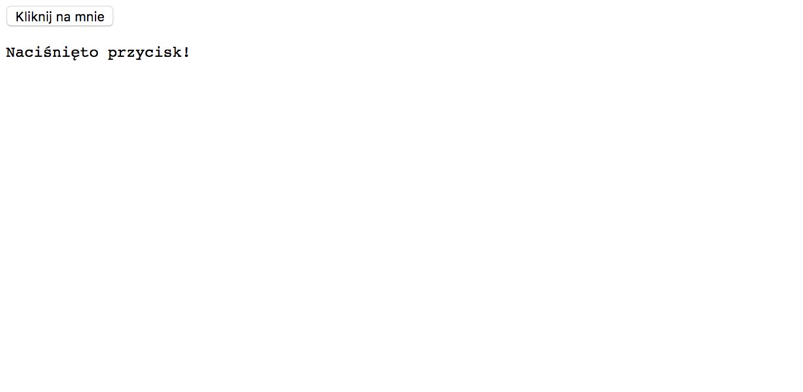

Wiele warsztatów z Javascriptu dla początkujących zaczyna się od zupełnych podstaw, a fajne rzeczy (jak bawienie się stronami internetowymi) zostawia dopiero na koniec.

To trochę nudne, więc my zajmiemy się od razu tymi fajniejszymi rzeczami.

Zaczniemy od prostej strony składającej się z przycisku i okna. Nic wielkiego, prawda?

Potem napiszemy kod, dzięki któremu to okno zmieni się po tym jak naciśniesz przycisk. 💥

Ale najpierw opiszmy, co tak właściwie robi ten kod, a w kolejnych lekcjach dodamy do tego jeszcze trochę szczegółów i porobimy różne inne fajne rzeczy.

Gotowi? Zaczynamy!

Najpierw stwórz nowy plik HTML - nazwij go jakkolwiek chcesz, byleby miał na końcu rozszerzenie `.html`. Potem wrzuć do tego pliku następującą treść:

```html
<!DOCTYPE html>
<html>
  <head>
    <meta charset="utf-8" />
    <title>Warsztaty z JSa!</title>
  </head>
  <body>
    <button id="przycisk">Kliknij na mnie</button>
    <pre id="okno"></pre>
  </body>
  <script>
    function zrobCos() {
      document.getElementById("okno").innerText = "Naciśnięto przycisk!";
    }
    document.getElementById("przycisk").onclick = zrobCos;
  </script>
</html>
```

Zapisz ten plik i otwórz go w przeglądarce.

Widzisz swój przycisk? Naciśnij na niego, a zobaczysz, że tekst "Naciśnięto przycisk!" pojawił się na stronie.

{:title="Your very first Javascript" class="img-responsive"}

{:title="Mind Blown" class="img-responsive"}

Co się tak właściwie stało?

Nasz plik to w większości zwykły HTML. Kiedy strona ładuje się w przeglądarce, ta czyta plik HTML i wyświetla elementy, które w nim znalazła.

Kiedy dochodzi do tagu `<script>`, przeglądarka przestaje odczytywać kolejne elementy strony i wykonuje instrukcje, które znalazła w tym tagu - a potem znowu odczytuje i wyświetla elementy strony, które znajdują się po tagu `<script>`. To pierwszy raz, kiedy nasza przeglądarka wykonuje kod.

A co tak właściwie się w nim zadziało?

No cóż, zrobiliśmy dwie rzeczy.

Najpierw stworzyliśmy funkcję o nazwie `zrobCos` (tak na przyszłość: **nazwy funkcji i zmiennych powinny być po angielsku**, ale dla ułatwienia zrozumienia przykładów będziemy posługiwać się w nich polskimi nazwami). Nasza funkcja szuka na stronie elementu z ID `okno` i potem ustawia tekst wewnątrz tego elementu na `Naciśnięto przycisk!`. A `document` i `getElementById` to wbudowane części DOM API - `document` to po prostu dokument z naszą stroną, a `getElementById` wyszukuje w nim element o określonym ID. Funkcja to z kolei kod, który możemy wykorzystać później - w innym miejscu niż to, w którym go napisaliśmy.

Nasz program znalazł element o ID `przycisk` i przekazał przeglądarce informację, że po jego kliknięciu powinna zostać wykonana funkcja `zrobCos`.

Tak więc kiedy naciskasz na przycisk, zmienia się tekst na stronie. Kiedy dochodzi do jakiegoś zdarzenia (ang. _event_), nasz kod działa po raz drugi i wykonuje funkcję, którą napisaliśmy na wypadek tego określonego zdarzenia.

Nazywamy to **programowaniem sterowanym zdarzeniami** (*event-driven*) – korzystają z niego programy pisane w Javascripcie.

Prawie wszystko, co dzieje się w przeglądarce, powoduje wykonanie jakiegoś zdarzenia. Możesz je sobie wyobrazić jako sygnał, że właśnie jakaś rzecz się wydarzyła. Załadowanie się strony, przewijanie jej, kliknięcie na jakiś element - te wszystkie rzeczy są zdarzeniami.

Kiedy piszemy kod, po prostu nakazujemy przeglądarce, co ma robić (jakie funkcje ma wykonać), kiedy dochodzi do określonych zdarzeń.

Teraz już co nieco wiemy, więc zagłębmy się w podstawy samego Javascriptu.
