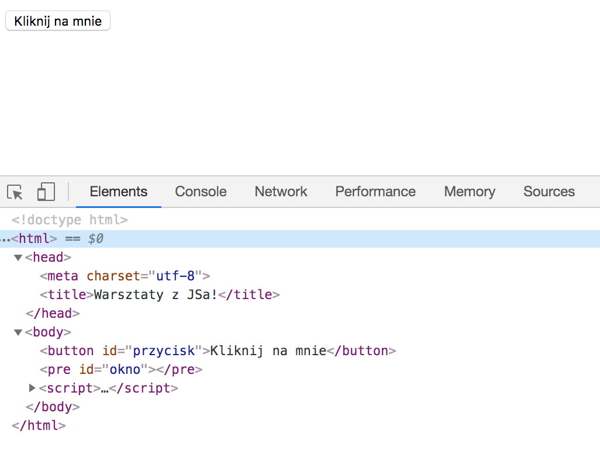
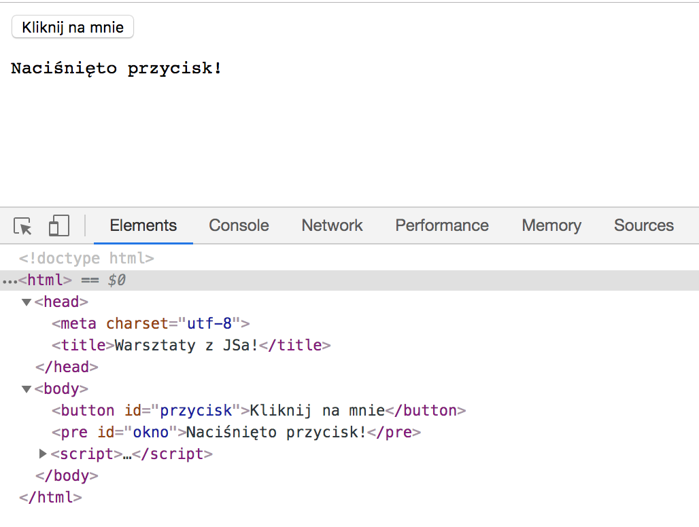
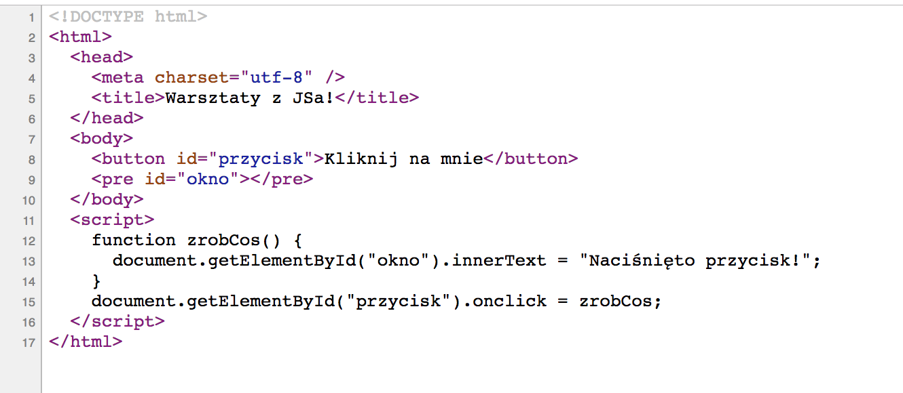

## Czym jest DOM?

DOM, nie dom 🏠

DOM to skrót od Document Object Model.

Kiedy strona się ładuje, przeglądarka nie wyświetla bezpośrednio kodu HTML. Zamiast tego odczytuje go i tworzy jego odwzorowanie na stronie. Właśnie te elementy odwzorowujące HTML nazywamy DOMem.

Kiedy kod Javascript zmienia jakiś element strony, nie zmienia się kod HTML, a tylko DOM.

Uruchom któryś z naszych poprzenich przykładów (na przykład ten z lekcji 1) i otwórz w przeglądarce narzędzia deweloperskie (a w nich zakładkę Elements lub Inspector w Firefoxie).

{:title="Elements/Inspector in DevTools" class="img-responsive"}

W tym oknie widzisz DOM stworzony dla aktualnej strony, który wygląda podobnie do kodu HTML.

Kiedy jednak wejdziesz w jakieś interakcje ze stroną, zobaczysz w narzędziach deweloperskich, że DOM został zaktualizowany.

{:title="Updated DOM in DevTools" class="img-responsive"}

Jeżeli klikniesz prawym przyciskiem myszy gdzieś na swojej stronie, zobaczysz w menu opcję `Wyświetl źródło` albo `Wyświetl źródło strony`. Kliknij na nią. Otworzy się nowe okno z pierwotnym kodem HTML strony, który może różnić się od aktualnego DOMu. To właśnie ten kod HTML posłużył do stworzenia DOMu podczas ładowania strony, ale jakiekolwiek późniejsze zmiany DOMu podczas interakcji ze stroną nie miały na niego wpływu.

{:title="View Source" class="img-responsive"}

Wprowadzanie zmian na stronie to po prostu operowanie jej DOMem. Często w ten sposób wybieramy jakieś elementy i zmieniamy ich właściwości albo dodajemy lub usuwamy z nich inne elementy.

Programowanie front-endowe w dużym stopniu wymaga spędzania dużych ilości czasu na badaniu stanu DOMu w narzędziach deweloperskich.

## Pobieranie węzłów - elementów

### Pobieranie pojedynczego węzła - elementu

Jak na razie pobieraliśmy węzły (elementy) za pomocą `getElementById()`. Określasz tam ID szukanego elementu, który następnie zostaje zwrócony.

```javascript
let naglowek = document.getElementById("naglowek");
```

<https://developer.mozilla.org/en-US/docs/Web/API/Document/getElementById>

Do tego samego możesz używać też `document.querySelector()`, przy czym wtedy w nawiasie musisz podać szukany selektor CSS. `document.querySelector()` zwróci wtedy pierwszy znaleziony element.

```javascript
let naglowek = document.querySelector("h2.artykul-naglowek");
```

<https://developer.mozilla.org/en-US/docs/Web/API/Document/querySelector>

### Pobieranie kilku węzłów - elementów

Pobieranie jednego elementu jest bardzo przydatne, ale co, jeśli chcesz operować na wielu? Służy do tego kilka funkcji:

`document.getElementsByClassName()` zwraca wszystkie elementy o podanej klasie.

<https://developer.mozilla.org/en-US/docs/Web/API/Document/getElementsByClassName>

`document.getElementsByTagName()` zwraca wszystkie elementy o podanym tagu.

<https://developer.mozilla.org/en-US/docs/Web/API/Document/getElementsByTagName>

`document.querySelectorAll()` działa tak jak `querySelector()`, tylko że zwraca wszystkie pasujące elementy.

<https://developer.mozilla.org/en-US/docs/Web/API/Document/querySelectorAll>

Każda z tych funkcji zwraca obiekt zwany `NodeList` (listą węzłów). Przypomina on tablicę, przy czym każdy obiekt w nim jest elementem ze strony.

## Modyfikowanie elementów

Kiedy pozyskasz już element ze strony dzięki użyciu którejś z powyższych metod, możesz łatwo go modyfikować.

`innerText` to właściwość, która zawiera tekst wewnątrz danego elementu. Dzisiaj korzystaliśmy z niej już kilka razy.

Zmienić możesz nie tylko tekst elementu, ale praktycznie każdą jego właściwość. Całą listę właściwości znajdziesz tutaj:
<https://developer.mozilla.org/en-US/docs/Web/API/Element>

## Usuwanie elementów

Do usunięciu elementu ze strony możesz skorzystać z metody `removeChild()` na jego rodzicu. Musisz więc mieć dostęp nie tylko do elementu, który chcesz usunąć, ale też do jego rodzica, który może przeprowadzić akcję usuwania.

```javascript
let rodzic = document.getElementById("listaKotow");
let dziecko = document.getElementById("kot_432");
rodzic.removeChild(dziecko);
```

<https://developer.mozilla.org/en-US/docs/Web/API/Node/removeChild>

## Dodawanie elementów

Dodawanie nowego elementu przeprowadza się w 3 krokach:

1. Tworzenie nowego elementu (i ustawianie jego właściwości)
2. Pozyskanie elementu rodzica
3. Dodanie nowego elementu do rodzica.

```javascript
let noweLi = document.createElement("li");
noweLi.innerText = kot.imie + " (" + kot.wiek + "/" + kot.kolor + ")";
let rodzic = document.getElementById("listaKotow");
rodzic.appendChild(noweLi);
```

W powyższym przykładzie `appendChild()` dodaje stworzony przez nas nowy element jako ostatnie dziecko innego elementu.

Są też inne funkcje służące do dodawania dzieci do elementów, chociażby `replaceChild()`, `insertBefore()`, i `append()`. O tworzeniu i dodawaniu elementów przeczytasz więcej tutaj:

- <https://developer.mozilla.org/en-US/docs/Web/API/Document/createElement>
- <https://developer.mozilla.org/en-US/docs/Web/API/Node/appendChild>
- <https://developer.mozilla.org/en-US/docs/Web/API/Node/replaceChild>
- <https://developer.mozilla.org/en-US/docs/Web/API/Node/insertBefore>
- <https://developer.mozilla.org/en-US/docs/Web/API/ParentNode/append>

### Zadanie: lista zakupów 🛒

Utwórz nowy mini projekt - prostą listę zakupów.

- ✅ Będzie zawierał input na produkt oraz przycisk "dodaj do listy". Przycisk ten spowoduje dodanie nowego elementu (np. elementu `<li>`) Przyda się też `div`/`ul` - rodzic, który będzie przechowywał listę zakupów.

- 🗑️ Rozszerzenie: zakupione produkty chcemy móc usuwać z listy.


## Jeszcze więcej o DOM

Dzisiaj ledwie musnęliśmy wszystkie możliwe sposoby modyfikowania i oddziaływania na DOM.

Więcej informacji na ten temat znajdziesz tutaj: <https://developer.mozilla.org/en-US/docs/Web/API/Document_Object_Model/Introduction>.
