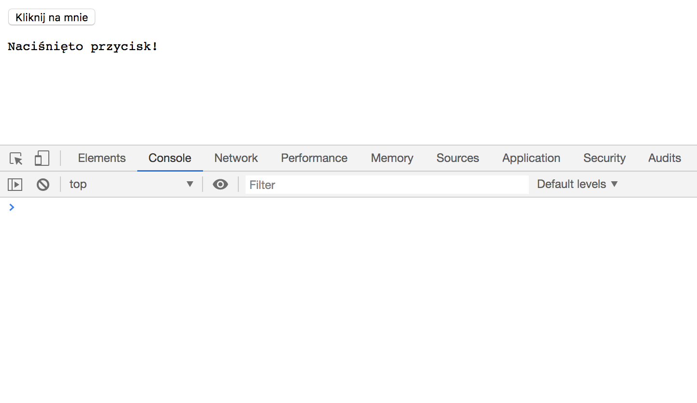
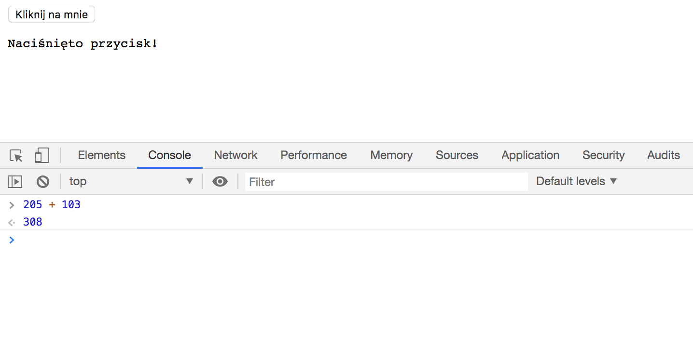

Większość twojego kodu będzie opierać się na manipulowaniu albo odczytywaniu różnych danych, które mogą pochodzić z pliku, od jakiegoś trzeciego podmiotu albo od użytkownika, który zaznaczył coś na stronie czy wpisał coś w okienku.

Te dane mogą mieć różne typy - mogą nimi być liczby, tekst itd. Dla przykładu, liczba `5` i napis `'Kliknij przycisk'` to dane dwóch różnych typów.

<!-- Zmienne to służą do przechowywania danych. Możesz wyobrażać je sobie jako opisane pudełka, do których wsadzać różne dane i później możesz z nich korzystać odwołując się do nazwy określonego pudełka. -->

**Operacje arytmetyczne** pozwalają nam na wykonywanie na danych działań matematycznych, takich jak dodawanie, odejmowanie, dzielenie, itd.

**Operatory** to z kolei symbole, których używamy do przeprowadzania tych operacji, takie jak `+`, `-`, `=`, itd.

**Wyrażeniem** jest łączenie kilku danych i przeprowadzanie na nich działań matematycznych, by dostać nową wartość.

To wszystko jest na razie dosyć abstrakcyjne, więc zróbmy kilka przykładów w **narzędziach deweloperskich** (po angielsku developer/dev tools) twojej przeglądarki.

## Narzędzia deweloperskie przeglądarki (dev tools)

Każda popularna przeglądarka ma interfejs, który pozwala ci na badanie stron internetowych. Właśnie to nazywamy **narzędziami deweloperskimi** (developer/dev tools).

Jednym z takich narzędzi jest konsola, która ma dwie podstawowe funkcje. Po pierwsze, wyświetla wszelkie informacje o błędach i tym podobnych, które wystąpiły na danej stronie. A po drugie, w konsoli możesz bezpośrednio wykonać kod napisany w Javascripcie.

Żeby otworzyć narzędzia deweloperskie swojej przeglądarki, wciśnij:

- Chrome i Firefox
  - Windows/Linux: `Ctrl`+`Shift`+`i`
  - MacOS: `CMD`+`Option`+`i`
- Safari
  - MacOS: `CMD`+`option`+`i`
- Edge
  - Windows: `F12` lub `Ctrl`+`Shift`+`i`

Narzędzia deweloperskie w Safari są domyślnie wyłączone, ale możesz je uruchomić wchodząc w _Safari -> Preferencje -> Zaawansowane_ i zaznaczając tam okno _"Pokazuj menu Programowanie na pasku menu"_.

Kiedy już otworzysz Narzędzia deweloperskie, otwórz w nich okienko o nazwie Console (po polsku to po prostu konsola).

{:title="Chrome Developer Tools" class="img-responsive"}

## Operacje arytmetyczne

Wpisz w konsoli liczbę `205` i wciśnij enter.

Jak widzisz, liczba `205` została wyświetlona po raz kolejny. To konsola wykonuje działanie na liczbie, którą w niej wpisujesz i wyświetla wynik. Tak więc, jeżeli wpiszesz w niej po prostu pojedynczą liczbę, to właśnie ta liczba jest wynikiem działania, bo nie wykonujesz na niej żadnych operacji.

Spróbujmy teraz `205 + 103`

{:title="Operations in the Console" class="img-responsive"}

W konsoli wyświetliła się liczba `308`. W tym wyrażeniu przeprowadziliśmy operację arytmetyczną z użyciem operatora `+`, czyli dodawania.

Głównymi operatorami matematycznymi są:

- `+`: dodawanie
- `-`: odejmowanie
- `*`: mnożenie
- `/`: dzielenie
- `MOD`: modulo, czyli reszta z dzielenia

I tak samo jak w matematyce, stosujemy tu **kolejność wykonywania działań** i możemy używać nawiasów `(` i `)`.

I tak, na przykład:

- `100+50*2` to `200`, ale
- `(100+50)*2` to `300`.

A teraz pobaw się trochę - powpisuj różne wartości w konsoli i zobacz, jakie dostaniesz wyniki.

### O co chodzi z `*` i `/`?

Dlaczego używamy `*` i `/` zamiast zwykłych symboli mnożenia i dzielenia?

Pierwsze klawiatury komputerowe były wzorowane na mechanicznych maszynach do pisania.

Osoby, które korzystły z takich maszyn nie potrzebowały ani symbolu mnożenia (bo mogły po prostu używać znaku `x`), ani symbolu dzielenia (bo mogły wpisać po prostu `-` i potem nadpisać na nim `:`, albo po prostu użyć samego znaku `:`). Ułamki z kolei zapisywano jako `1/2` czy `3/4`.

(Co prawda, maszyny z wyższej półki miewały specjalne klawisze z symbolami mnożenia i dzielenia, ale jakoś nigdy się to nie przyjęło).

Tak więc kiedy zaczęliśmy używać klawiatur komputerowych, "odziedziczyliśmy" to ograniczenie i wymyśliliśmy sposób, żeby je obejść - do ułamków i dzielenia używając znaku `/`, a do mnożenia `*`.

### Typy danych

Jak widzisz, wszystkie dane, na których do tej pory pracowaliśmy, to liczby. Ale co, jeżeli chcesz użyć czyjegoś imienia? Jak to zrobić?

Przyjrzyj się kodowi, który już napisaliśmy. W jaki sposób napisaliśmy wiadomość, która wyświetliła się po naciśnięciu przycisku?

```javascript
document.getElementById("okno").innerText = "Naciśnięto przycisk!";
```

Kiedy otoczymy jakieś znaki cudzysłowem, tworzymy daną typu **string**, czyli po prostu ciąg liter, liczb czy innych znaków. Możesz wyobrazić sobie string jako banner, na którym napisana jest jakaś treść.

{:title="Bunting" class="img-responsive imgbox"}

Różne typy wartości mają różne przeznaczenie - już sam typ wskazuje nam, co zawiera dana wartość i w jaki sposób powinna się zachowywać.

Na przykład, wiemy czego oczekiwać po działaniu `100+50`. Ale co z `'100'+'50'`? Spróbuj wpisać to w konsoli.

Javascript rozpoznał, że obie wartości są stringami, więc kiedy je dodajesz, po prostu je ze sobą łączy. Nazywamy to **konkatenacją**.

Innym przykładem może być dodanie do siebie imienia i nazwiska jakiejś osoby, przykładowo `'Anna' + ' ' + 'Nowak'`. Zauważ jednak, że połączyliśmy tu trzy stringi. Drugi z nich to string ze spacją, która też jest znakiem. Stringiem może być nie tylko pojedynczy znak, ale też słowo, zdanie albo nawet kilka akapitów - jakikolwiek ciąg znaków, których chcesz użyć. Istnieją także puste stringi, czyli `''` (bez jakiegokolwiek znaku w środku).

Ale co z innymi operatorami arytmetycznymi? Co się stanie, kiedy pomnożysz albo odejmiesz od siebie kilka stringów?

Spróbujmy.

Wpisz `'Kot' / 'Pies'`.

Wynikiem takiego działania jest specjalna wartość - **NaN**, co oznacza **Not a Number** (po polsku możesz to przetłumaczyć jako _Nie jest liczbą_). Jak widzisz, nie wszystkie działania matematyczne mogą być wykonane na pewnych typach danych - dlatego też wartości takie jak `NaN` są używane do wyłapywania błędów w kodzie.

Ale wróćmy jeszcze do typów danych - poza liczbami i stringami wyróżniamy też między innymi **tablice**, **booleany** (czyli wyrażenia logiczne) i **obiekty**.

Omówimy każde z nich, kiedy natkniemy się na nie w kodzie.

## Konwersja typów

Na razie mówiliśmy jedynie o przeprowadzaniu operacji na wartościach tego samego typu (na przykład na dwóch liczbach). Ale co się stanie, jeżeli spróbujesz przeprowadzić operację na danych różnych typów? Chociażby pomnożyć string przez liczbę? Albo dodać do siebie string i liczbę?

Istnieją dwie proste zasady przeprowadzania takich działań:

1. Jeżeli operatorem jest `+`, liczby zostają przekonwertowane na string i wykonywana jest konkatenacja (na przykład: `"Ania" + 2` zostanie przekonwertowane na `"Ania" + "2"` i w wyniku konkatenacji uzyskamy `"Ania2"`).
2. W każdym innym przypadku javascript próbuje przekonwertować string na liczbę i wykonać działanie matematyczne. Jeżeli string nie może zostać zmieniony na liczbę, jako wynik zostaniesz znany ci już `NaN`.

Takie zmiany typów danych nazywamy **konwersją typów**.

Wypróbuj w konsoli jeszcze inne działania, chociażby:

- `'50' + 5`
- `'50' * 5`
- `'Kot' + 102`
- `'Pies' / 3`

No dobrze, wiemy już, czym są dane i ich typy, operatory i wyrażenia.

Teraz zajmiemy się zmiennymi.
