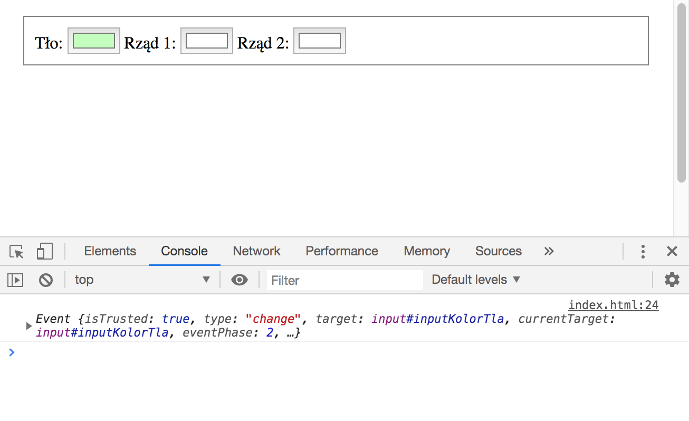
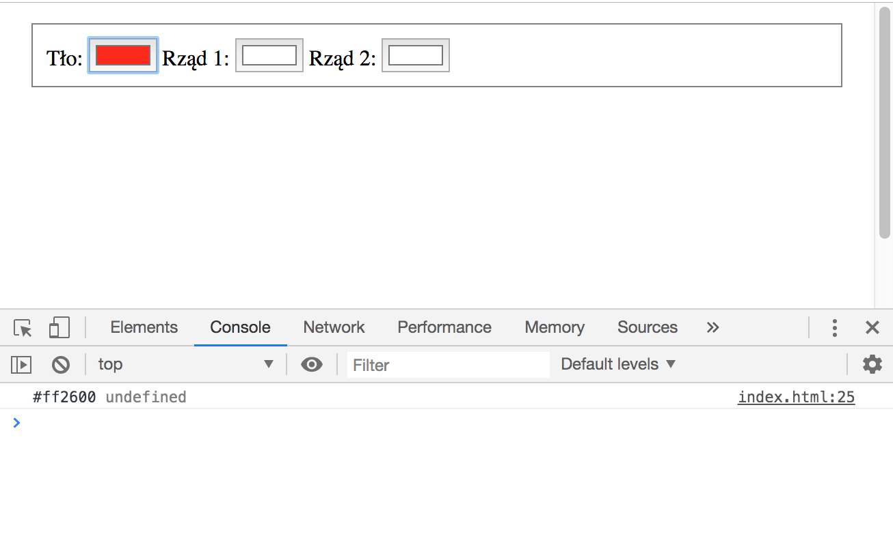
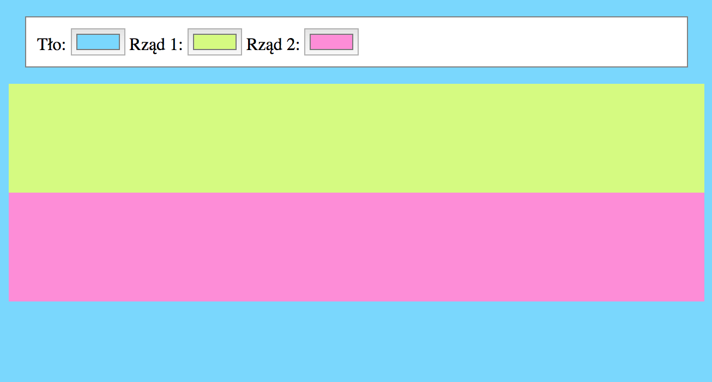
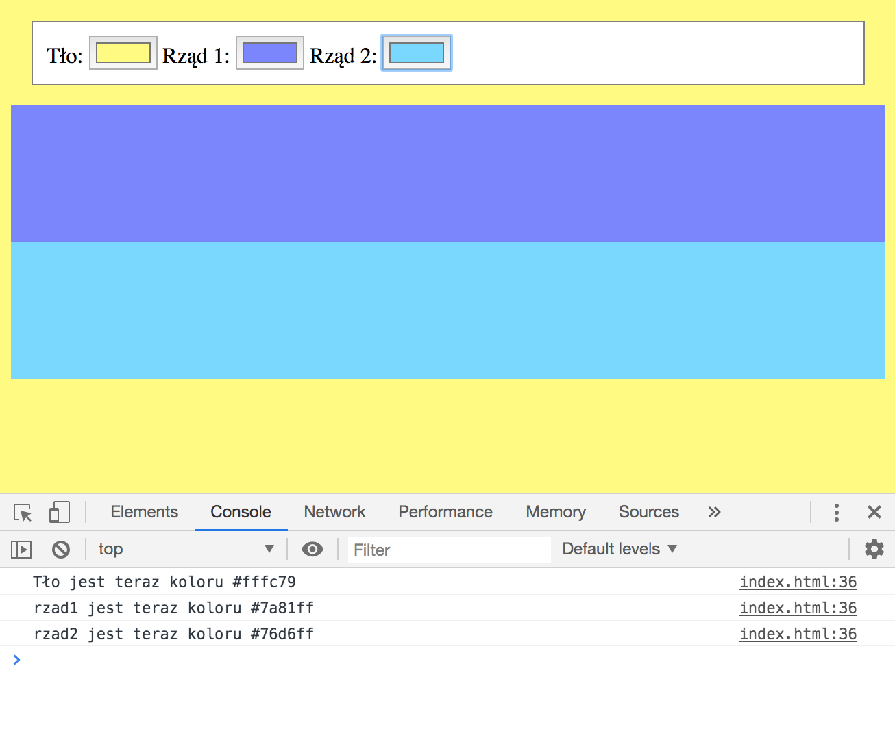
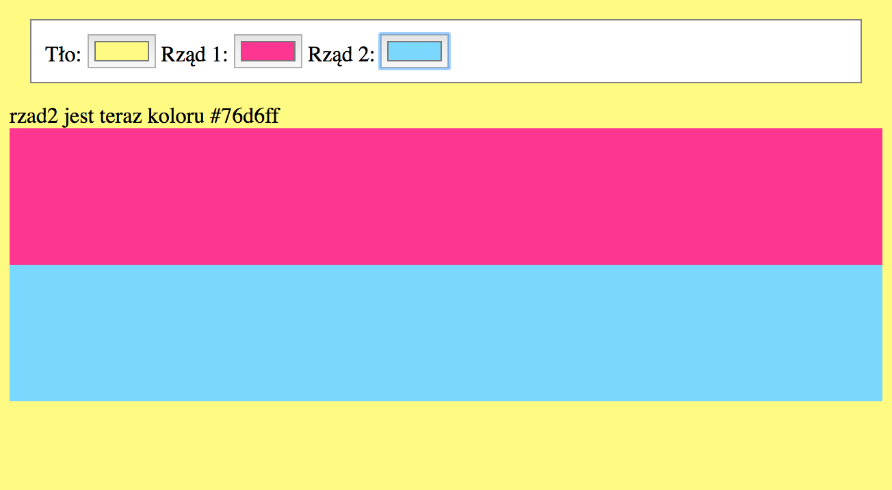
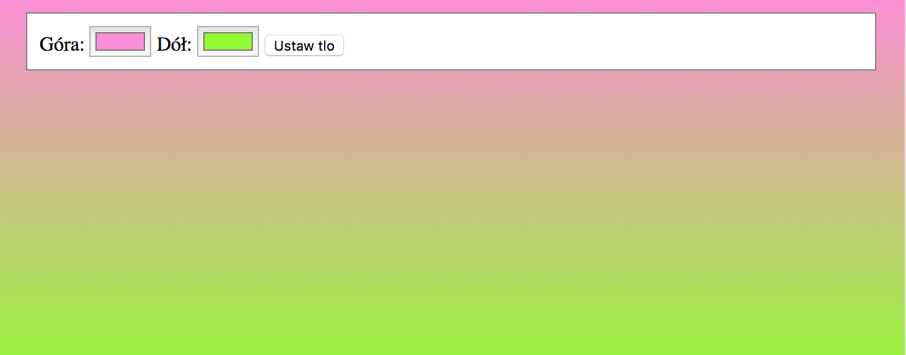

Funkcje pozwalają nam na dzielenie jednej wielkiej listy zadań w naszym programie na kilka mniejszych list. To takie jakby pisanie małych programików w większym programie.

Na razie używaliśmy ich do przypisania reakcji na jakieś zdarzenia, w szczególności na kliknięcie na przycisk (`onclick`), ale możesz z nich korzystać również w innych przypadkach.

Dzielenie całego kodu na funkcje sprawia, że zamiast jednego wielkiego programu mamy wiele małych programików. Ale co tak właściwie nam to daje?

1. Małe programy łatwiej się pisze.
2. Małe programy są łatwiejsze do przeczytania i zrozumienia.
3. Oszczędzamy czas, bo jednej funkcji możemy użyć w kilku miejscach.

A więc, pobawmy się funkcjami tworząc kolejną aplikację.
Czego się przy okazji nauczymy?

- **deklarowania** funkcji,
<!-- w sumie raczej definiowania – deklarowanie było w C/C++, żeby powiedzieć "później napiszę funkcję, która przyjmuje takie parametry i zwraca taki typ" -->
- **wywoływania** funkcji,
- **parametrów** i **argumentów** funkcji,
- **wartości zwracanych** przez funkcje.

Bierzmy się do roboty!

## Tworzymy HTML

Stwórz nowy plik z następującym kodem HTML.

```html
<!DOCTYPE html>
<html>
  <head>
    <meta charset="utf-8" />
    <title>Warsztaty z JSa!</title>
    <style>
#kolory {
  padding:10px;
  margin: 15px;
  border:1px solid grey;
  background-color: #ffffff;
}

#rzad1, #rzad2 {
  width:100%;
  height:100px;
}    
    </style>
  </head>
  <body>
    <div id="kolory">
      Tło:
      <input id="inputKolorTla" name="tlo" type="color" value="#ffffff" />
      Rząd 1:
      <input id="inputKolorRzad1" name="rzad1" type="color" value="#ffffff" />
      Rząd 2:
      <input id="inputKolorRzad2" name="rzad2" type="color" value="#ffffff" />
    </div>
    <div id="komunikat"></div>
    <div id="rzad1"></div>
    <div id="rzad2"></div>
  </body>
  <script></script>
</html>
```

Zapisz plik i otwórz go w przeglądarce.

{:title="Starting page" class="img-responsive"}

Na stronie zobaczysz trzy pola do wyboru koloru - jeśli klikniesz na któreś, otworzy się paleta kolorów.
Jak to zrobiliśmy? Używając elementów `<input>` typu (`type`) `color`.

Nasza strona zawiera też trzy puste elementy `<div>`.

Zwróć uwagę, że każdy `<input>` ma swój atrybut `name`.
Dwa z nich są takie same jak atrybuty `id` pustych divów, a trzeci to po prostu `tlo`.
Te informacje przydadzą nam się później - będziemy wiedzieli, który input zmieniający kolor jest powiązany z którym elementem strony.

Teraz w tagu `<script>` dodajmy kod, dzięki któremu po wyborze koloru, taki sam kolor przybierze określony element strony.

## Deklarowanie funkcji

Tworzenie nowej funkcji nazywamy jej **deklarowaniem**.

A więc, zadeklarujmy nową funkcję `zmianaKoloru`:

```javascript
function zmianaKoloru(event) {}
```
<!-- Nie lepiej `zmienKolor`?
We wszystkich poprzednich przykładach nazwy funkcji były w formie rozkazującej
i tak się chyba zwykle pisze. -->

Do deklarowania funkcji używamy:

1. Słowa kluczowego `function`.
2. Nazwy nowej funkcji, `zmianaKoloru`.
3. Opcjonalnie listy parametrów w nawiasach okrągłych, `(event)` <!-- To sugeruje, że nawiasy też można opuścić -->
4. Ciała funkcji w nawiasach klamerkowych, `{` `}`

Funkcja `zmianaKoloru` jeszcze nic nie robi, ale i tak możemy ją już przypisać do wydarzenia `onchange` na każdym z naszych inputów.

```javascript
document.getElementById("inputKolorTla").onchange = zmianaKoloru;
document.getElementById("inputKolorRzad1").onchange = zmianaKoloru;
document.getElementById("inputKolorRzad2").onchange = zmianaKoloru;
```

## Parametry i argumenty

**Argumenty** pozwalają nam na korzystanie z pewnych wartości podczas wykonywania funkcji. Nazywamy to zwykle **przekazywaniem argumentów**.

**Parametry** pozwalają Ci na odnoszenie się do tych wartości wewnątrz funkcji podczas jej deklarowania.

<!-- Czy jest sens się rozpisywać o tym rozrónieniu? Mam wrażenie, że wielu programistów
(w tym ja) używa nazw "parametr" i "argument" wymiennie.

https://stackoverflow.com/questions/156767/whats-the-difference-between-an-argument-and-a-parameter
-->

Nasza funkcja `zmianaKoloru` ma jeden parametr, `event` (po polsku _zdarzenie_).
Funkcje powiązane ze zdarzeniami są wykonywane, kiedy dochodzi do określonego zdarzenia. Kiedy to się wydarzy, przeglądarka przekaże informacje o tym wydarzeniu jako argument funkcji.

Ale czym tak właściwie jest `event`? Umieśćmy w najszej funkcji `console.log`, żeby się przekonać.

Funkcja `zmianaKoloru` powinna teraz wyglądać tak:

```javascript
function zmianaKoloru(event) {
  console.log(event);
}
```

Odśwież stronę, otwórz konsolę i kliknij na jeden z inputów, by zmienić kolor elementu strony.

Konsola wyświetli dane o zdarzeniu.

{:title="Event in the console" class="img-responsive"}

Po kliknięciu na mały trójkąt lista danych rozwinie się, dzięki czemu poznasz jego najdrobniejsze szczegóły.

Jak widzisz, obiekt `event` ma wiele właściwości, które szczegółowo go opisują, ale nas na razie interesować będzie jedna z nich - właściwość `target`. `target` to po prostu inny obiekt, który odnosi się do elementu, który wywował określone zdarzenie. Dzięki niemu możemy dowiedzieć się, jaki jest nowy wybrany klor.

Zmieńmy więc nasz `console.log`, aby poznać więcej interesujących nas szczegółów.

```javascript
function zmianaKoloru(event) {
  console.log(event.target.name, event.target.value);
}
```

No dobrze, teraz nasza funkcja `zmianaKoloru` ma informacje, których potrzebuje - nazwę inputa i nowy kolor. Żeby uaktualnić nasz kolor, stworzymy jednak nową funkcję i ją stąd wywołamy.

Zadeklarujmy szybko nową funkcję o pustym ciele:

```javascript
function ustawKolor(kolor, element) {}
```

Zauważ, że ma ona dwa parametry, `kolor` i `element`.

Ale w jaki sposób mamy ją wywołać w funkcji `zmianaKoloru`?

## Wywoływanie funkcji

Wywoływanie funkcji jest naprawdę proste - po prostu podajesz nazwę funkcji, a za nią wpisujesz nawiasy okrągłe. Jeżeli chcesz przekazać do funkcji jakieś argumenty, wpisz je w tych nawiasach.

A więc, zmieńmy funkcję `zmianaKoloru`, tak, by wywoływała funkcję `ustawKolor`, która na razie będzie tylko wyświetlała w konsoli swoje parametry.

```javascript
function ustawKolor(kolor, idElementu) {
  console.log(kolor, idElementu);
}

function zmianaKoloru(event) {
  ustawKolor(event.target.value, event.target.name);
}
```

W taki sposób przekazujemy wartości z jednej funkcji do drugiej.

Nasze funkcje jednak na razie jeszcze nie są zbyt przydatne. W tym celu dodajmy do funkcji `zmianaKoloru` kilka warunków:

```javascript
function zmianaKoloru(event) {
  if (event.target.name === "tlo") {
    ustawKolor(event.target.value);
  } else {
    ustawKolor(event.target.value, event.target.name);
  }
}
```

Teraz, jeżeli spróbujesz zmienić kolor tła, funkcja `ustawKolor` zostanie wywołana tylko z jednym parametrem? A jaką wartość przyjmie wtedy drugi parametr?

Spróbuj to zrobić i wyświetl efekty w konsoli.

{:title="Undefined parameters in the console" class="img-responsive"}

Jeżeli wywołując funkcję przekazano do niej mniej argumentów niż zadeklarowano w niej parametrów, "nadliczbowe" parametry przyjmą wartość `undefined`, taką samą jak niezainicjalizowane zmienne!

Wykorzystamy tę właściwość w funkcji `ustawKolor`, ponieważ zmiana koloru tła strony odbędzie się trochę inaczej niż zmiana koloru poszczególnych divów.

Zmieńmy w takim razie ciało naszej funkcji `ustawKolor`:

```javascript
function ustawKolor(kolor, idElementu) {
  if (idElementu === undefined) {
    document.bgColor = kolor;
  } else {
    document.getElementById(idElementu).style.backgroundColor = kolor;
  }
}
```
<!-- Nie lepiej `document.body.style.backgroundColor`? -->

Teraz, jeżeli nasze `idElementu` ma wartość undefined, tło strony zmieni się na wybrany przez nas `kolor`.
W przeciwnym razie zmieni się kolor wybranego przez nas elementu.

Wypróbuj to!

{:title="Undefined parameters in the console" class="img-responsive"}

## Wartości zwracane przez funkcje

Funkcje mają jeszcze jedną cechę, z której na razie nie korzystaliśmy - **zwracają określone wartości**.
Dzięki tym wartościom możemy przekazywać dane z wewnątrz funkcji z powrotem do elementu, który je wywołał. Czasem nazywamy je więc wynikami funkcji.

Określoną wartość zwracamy używając słowa kluczowego `return`.

Żeby przekonać się, jak to działa, przekażmy nasze argumenty `idElementu` i `kolor` do innej funkcji, która wyświetli informacje o dokonanej zmianie.

```javascript
function pokazKomunikat(kolor, idElementu) {
  if (idElementu === undefined) {
    return "Tło jest teraz koloru " + kolor;
  }
  return idElementu + " jest teraz koloru " + kolor;
}
```

Kiedy funkcja natyka się na słowo kluczowe `return`, natychmiast kończy działanie i przekazuje określoną wartość z powrotem do kodu, który ją wywołał.

Wywołajmy teraz tę funkcję w funkcji `ustawKolor` i wyświetlmy efekty w konsoli. W tym celu na końcu ciała funkcji `ustawKolor` dodaj poniższą linijkę kodu:

```javascript
console.log(pokazKomunikat(kolor, idElementu));
```

Zapisz plik i wypróbuj swój kod w przeglądarce. Zauważ, że wartości zwracane poprzez `return` w funkcji `pokazKomunikat` są przekazywane do konsoli poprzez `console.log`.

{:title="getMessage displayed by console" class="img-responsive"}

A więc, zwrócone wartości pojawiły się w miejscu, w którym wywołaliśmy funkcję.

Zróbmy teraz coś bardziej skomplikowanego. W funkcji `ustawKolor` zastąp `console.log` poniższym kodem:

```javascript
document.getElementById("komunikat").innerText = pokazKomunikat(
  kolor,
  idElementu
);
```

Teraz, kiedy zmienisz kolor któregoś elementu, na stronie pojawi się o tym adekwatna wiadomość.

{:title="Final" class="img-responsive"}

Jeżeli chcesz, możesz przenieść tę ostatnią linijkę z funkcji `ustawKolor` do funkcji `zmianaKoloru`, ale to wymagałoby kilku małych zmian. Jak myślisz, jakich? Spróbuj to zrobić!

#### Zadanie

1. Utwórz nowy plik HTML, który będzie zawierał 2 pola wyboru koloru (góra i dół) i przycisk `ustaw kolor`.
2. Ustaw CSS strony tak, by body zajmowało 100% wysokości ekranu, oraz miało domyślny kolor tła ustawiony jako czarno-biały gradient:
```
background: linear-gradient(#ffffff, #000000);
height: 100vh;
```
3. Korzystając ze zdobytej wiedzy i Google'a spraw, by po ustawieniu 2 kolorów i kliknięciu `ustaw kolor` zmienił się gradient.

{:title="Task" class="img-responsive"}

Poniżej znajdziesz rozwiązanie naszego zadania:

```html
<!DOCTYPE html>
<html>
  <head>
    <meta charset="utf-8" />
    <title>Warsztaty z JSa!</title>
  </head>
  <body style="background: linear-gradient(#ffffff, #000000);height: 100vh;">
    <div
      style="padding:10px; margin: 15px; border:1px solid grey; background-color:#ffffff"
    >
      Góra:
      <input id="inputGora" name="gora" type="color" value="#ffffff" />
      Dół:
      <input id="inputDol" name="dol" type="color" value="#000000" />
      <button id="ustaw">Ustaw tlo</button>
    </div>
  </body>
  <script>
    function ustawKolor() {
        kolorGora = document.getElementById("inputGora").value;
        kolorDol = document.getElementById("inputDol").value;
        kolorGradient = "linear-gradient(" + kolorGora + "," + kolorDol + ")";
        document.body.style.background = kolorGradient;
    }
    document.getElementById("ustaw").onclick = ustawKolor;
  </script>
</html>
```
{: .solution }
