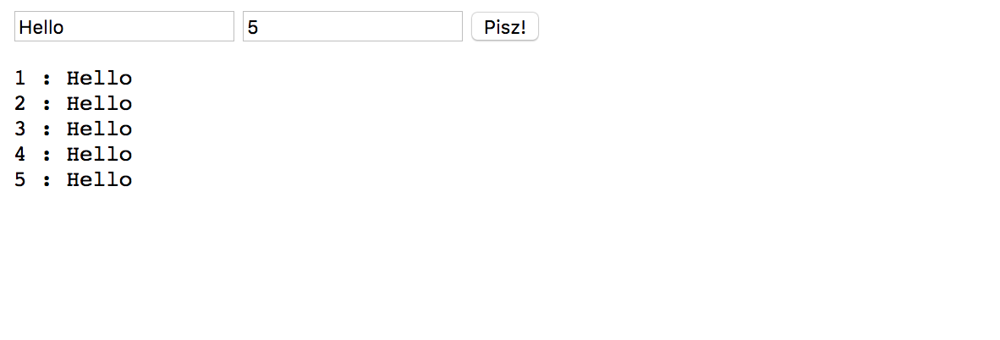

Często chcemy, by nasz kod wykonał się kilkukrotnie, nie wiedząc jednocześnie, ile dokładnie razy ma się powtórzyć.

Nasz problem rozwiązują wtedy **pętle** - jest ich wiele, ale dzisiaj zajmiemy się pętlą `for`.

## Pętla `for`

Pętla `for` służy do powtarzania kodu.

Stwórzmy nową stronę, na której podasz jaka wiadomość ma się wyświetlić - i ile razy ma to zrobić.

```html
<!DOCTYPE html>
<html>
  <head>
    <meta charset="utf-8" />
    <title>Warsztaty z JSa!</title>
  </head>
  <body>
    <input type="text" id="wiadomosc" placeholder="Co chcesz napisać?" />
    <input type="text" id="licznik" placeholder="Ile razy?" />
    <button id="przycisk">Pisz!</button>
    <pre id="oknoZWiadomoscia" />
  </body>

  <script>
    function pokazWiadomosc() {
      let liczbaPowtorzen = document.getElementById("licznik").value;
      let wiadomosc = document.getElementById("wiadomosc").value;

      let rezultat = "";
      for (let i = 1; i <= liczbaPowtorzen; i++) {
        rezultat = rezultat + i + " : " + wiadomosc + "\n";
      }
      document.getElementById("oknoZWiadomoscia").innerText = rezultat;
    }
    document.getElementById("przycisk").onclick = pokazWiadomosc;
  </script>
</html>
```

Spróbuj!

{:title="For loop" class="img-responsive"}

Zwróć tylko uwagę, że jeśli w liczniku podasz liczbę większą niż około 10000, twoja strona prawdopodobnie zwolni, a przy liczbach rzędu 30000 minie sekunda czy dwie zanim strona się zaktualizuje.

Wykonanie pętli jeden raz zajmuje jakiś ułamek sekundy, ale powtórzenie tej czynności dziesiątki tysięcy razy wymaga już trochę czasu.

Przyjrzyjmy się dokładniej naszej pętli:

```javascript
for (let i = 1; i <= liczbaPowtorzen; i++) {
  rezultat = rezultat + wiadomosc + "\n";
}
```

Pętla składa się z dwóch części:

1. Deklaracji pętli, `for (let i = 1; i <= liczbaPowtorzen; i++)`. Deklaracja wygląda trochę jak wywołanie funkcji, ale to coś innego. Deklaracja pętli określa po prostu, jak nasza pętla ma działać.

2. Ciała pętli, czyli kodu który ma się wykonać za każdym powtórzeniem pętli.

Deklaracja pątli składa się ze słowa kluczowego `for` i trzech wyrażeń w nawiasie okrągłym, oddzielonych od siebie średnikami.

1. Pierwsze wyrażenie to wyrażenie inicjalizacji: `let i = 0`.
   Tworzymy w ten sposób licznik `i`, który będzie przechowywał informację o tym, który raz wykonuje się pętla.

2. Drugim wyrażeniem jest warunek: `i<=liczbaPowtorzen`
   Warunek ten sprawdzany jest przez każdym wykonaniem pętli - jej ciało wykona się tylko wtedy, jeżeli nasz warunek jest prawdziwy (a jeżeli jest fałszywy, pętla się kończy).
   W naszym przykładzie oznacza on, że kiedy wartość `i` jest mniejsza lub równa niż `liczbaPowtorzen`, pętla wykonuje się po raz kolejny.

3. Trzecim wyrażeniem jest wyrażenie inkrementacji: `i++`. Wykonuje się ono po wykonaniu kodu z ciała pętli.
   W pętli powyżej po każdym dodaniu kolejnej wiadomości do zmiennej `output`, nasz licznik `i` zwiększa się o 1 (zapis `i++` oznacza to samo co `i + 1`).

Po tym kiedy nasza pętla wykonała się już określoną liczbę razy, ustawiamy tekst w `oknoZWiadomoscia` na nasz `rezultat`.

Czy myślisz, że uda ci się zmienić działanie naszej pętli w taki sposób, że będzie liczyć od `liczbaPowtorzen` do `1`, a nie od `0` do `liczbaPowtorzen`? Spróbuj!

### Co tak wolno?

Jeżeli tekst ma być powtórzony naprawdę wiele razy, powiedzmy `32000`, pętla będzie potrzebowała kilku sekund, by się wykonać i zaktualizować stronę.

Ale co się stanie jeżeli kod aktualizujący treść strony umieścimy _wewnątrz_ pętli?

Spróbujmy.

```html
<script>
  function pokazWiadomosc() {
    let liczbaPowtorzen = document.getElementById("licznik").value;
    let wiadomosc = document.getElementById("wiadomosc").value;

    let rezultat = "";
    for (let i = 1; i <= liczbaPowtorzen; i++) {
      rezultat = rezultat + i + " : " + wiadomosc + "\n";
      document.getElementById("oknoZWiadomoscia").innerText = rezultat;
    }
  }
  document.getElementById("przycisk").onclick = pokazWiadomosc;
</script>
```

Niestety nasz kod nie działa. Dlaczego?

Zawartość strony może być zaktualizowana tylko po wykonaniu kodu javascript - musi więc czekać, aż ten skończy powtarzanie pętli. Tak w dużym uproszczeniu, jeżeli twój kod potrzebuje dużo czasu na wykonanie się, na stronie nic będzie mogło się w tym czasie wydarzyć. A więc nauczka na przyszłość - unikaj długich pętli!

### Inne rodzaje pętli

Istnieją też inne rodzaje pętli - jednak większość z nich powtarza pewne działanie określoną liczbę razy, aż do momentu spełnienia warunku albo tak długo jak warunek jest spełniany. Ich działanie jest więc podobne do naszej pętli `for`.
